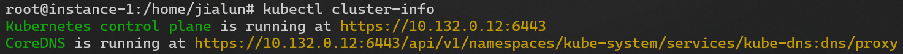
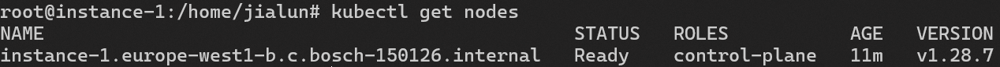
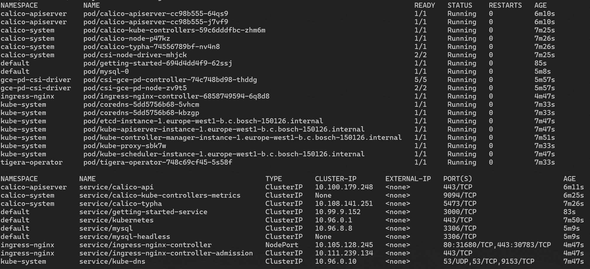
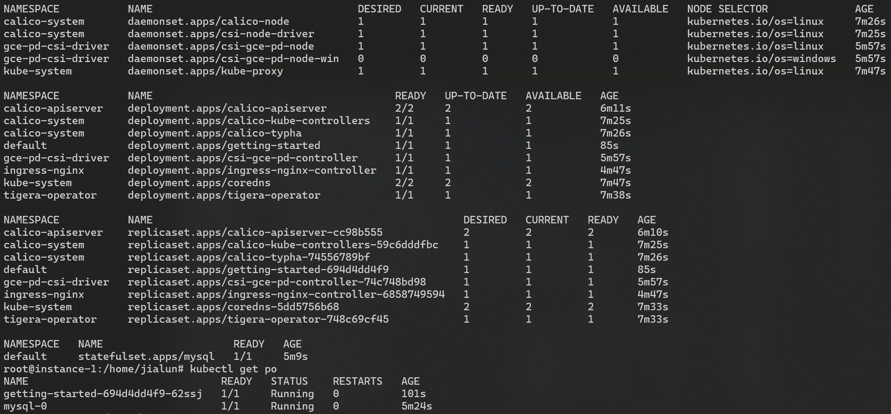

# Programing Challenge Operations K8S

## APP Link
~~http://35.187.74.163:31680/~~

## Project Structure
```
programming-challenge-operations-k8s/ansible/
│
├── inventory/        # Directory containing Ansible inventory files
│   └── hosts.ini     # INI file defining hosts and groups for Ansible to target
│
├── roles/            # Directory for Ansible roles, modularizing tasks
│   ├── vm/           # Role for managing VM provisioning (GCE) and VPC firewall configuration
│   ├── k8s/          # Role for setting up and configuring the Kubernetes cluster with add-ons like Calico, Helm
│   ├── db/           # Role for deploying and managing the PV driver, PV, and database
│   └── app/          # Role for deploying the application, interacting with MySQL, exposing services through Ingress
│
├── requirements.txt  # Python requirements file for Ansible modules, GCP SDK, and Kubernetes operations
├── create_vm.yml     # Ansible playbook for orchestrating VM provisioning and VPC confiuration
└── create_app.yml    # Ansible playbook for K8s setup, DB and APP deployment
```

## Create Ansible Env
Under `ansible/` run
```shell
VENVDIR=.venv
python3 -m venv $VENVDIR
source $VENVDIR/bin/activate
pip install -U -r requirements.txt
```

and run
```shell
ansible-playbook -i inventory/hosts.ini create_vm.yml
ANSIBLE_HOST_KEY_CHECKING=False ansible-playbook -i inventory/hosts.ini --become --become-user=root create_app.yml
```

## Cluster Status

### Cluster Info

### Node Info

### All Info


